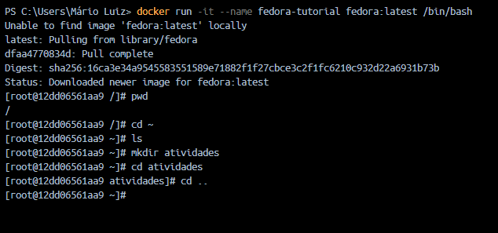
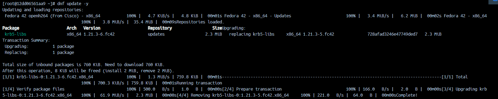
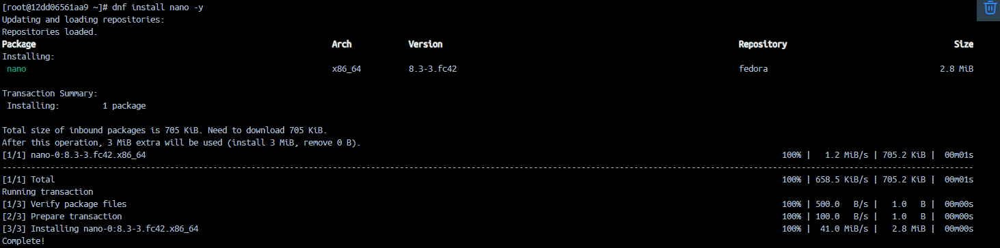
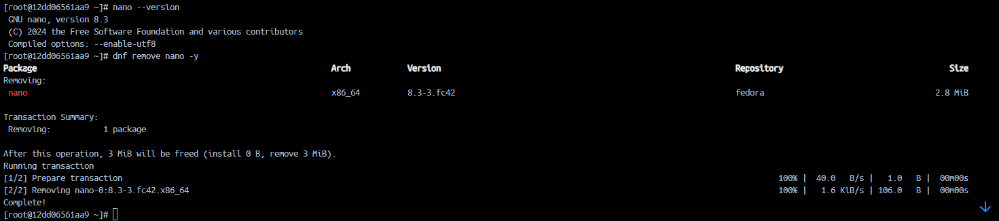
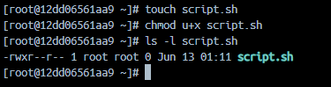
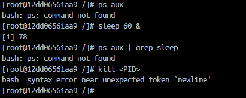
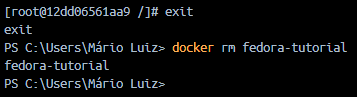

# S.O. 2025.1 - Atividade 02 - Introdução a linux usando docker no windows

### Nome: Rebeca Noemi Silva Ferreira

### Data: 02/05/2025

## Introdução:

Esta atividade teve como finalidade explorar os conceitos fundamentais do Linux, incluindo sua estrutura básica, comandos essenciais e princípios importantes do sistema.

## 1. Navegação Básica:

* Foram executados comandos simples com o objetivo de aprender a se deslocar entre diretórios no Linux, além de criar e remover pastas.
  

## 2. Gerenciamento de pacotes:

* Nesta parte, foram utilizados comandos voltados para o controle de pacotes: atualização da lista, instalação do editor de texto Nano, verificação da versão instalada e posterior remoção do mesmo.
  
  
  

## 3. Permissões de arquivos:

* Foram aplicados comandos para alterar permissões de acesso a arquivos e entender o controle de usuários sobre os mesmos.
  

## 4. Processos em execução:

* Utilização de comandos para visualizar e encerrar processos ativos no sistema.
* Observação: tive dificuldade nessa etapa, pois, ao utilizar o Codespace, os resultados pareceram diferentes do esperado, possivelmente por conta de limitações na minha máquina.
  

## 5. Encerrando o contêiner:

* Comandos utilizados para finalizar e excluir o contêiner utilizado durante a atividade.
  

## O que aprendi e as dificuldades:

* Consegui aprender os comandos básicos e mais importantes do ambiente Linux;
* A principal dificuldade foi utilizar o Codespace como alternativa, já que meu computador possui limitações. Acredito que isso influenciou nos resultados, que poderiam ter sido diferentes em um ambiente local.
